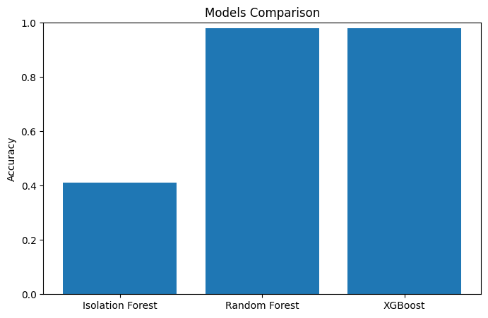
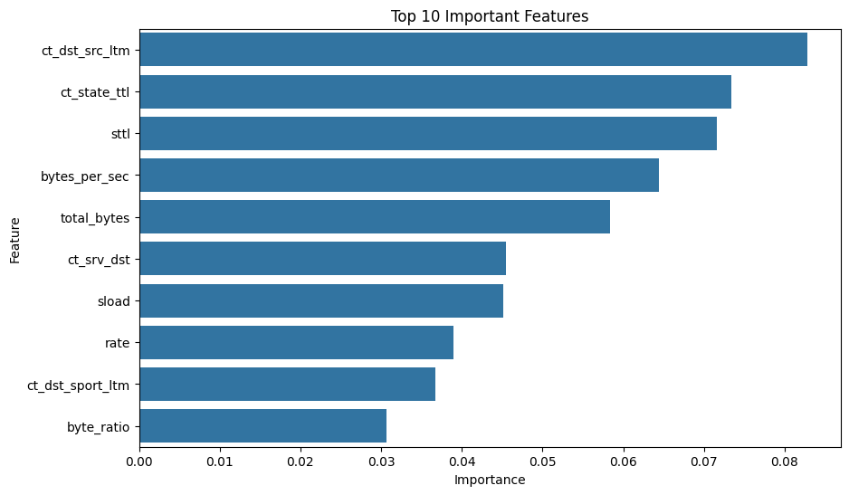

# AI-Driven Network Anomaly Detection using Machine Learning

## 📌 Project Overview
This project focuses on detecting and classifying network attacks using Machine Learning techniques on the UNSW-NB15 dataset.

We compared both unsupervised and supervised learning approaches for network intrusion detection.

---

## 🚀 Models Used

### Unsupervised Learning
- Isolation Forest

### Supervised Learning
- Random Forest
- XGBoost

### Multi-class Classification
- XGBoost for attack type classification

---

## 📊 Dataset
- UNSW-NB15 Dataset
- Includes normal traffic and multiple attack categories:
  - DoS
  - Exploits
  - Generic
  - Reconnaissance
  - Backdoor
  - Shellcode
  - Worms
  - and others

---

## ⚙️ Project Workflow

1. Exploratory Data Analysis (EDA)
2. Data Preprocessing
3. Feature Engineering
4. Binary Classification
5. Multi-class Classification
6. Model Evaluation
7. Visualization & Analysis

---

## 📈 Results Summary

| Model | Accuracy |
|------|------|
| Isolation Forest | 41% |
| Random Forest | 98% |
| XGBoost | 98% |

### Key Findings
- Supervised learning significantly outperformed anomaly detection approaches.
- Feature engineering improved model performance.
- Multi-class classification performance was affected by class imbalance.

---

## 📊 Visualizations

### Model Comparison

### Feature Importance

The project includes:
- Model comparison graphs
- Recall comparison
- Feature importance analysis
- Multi-class confusion matrix
- Attack distribution analysis

---

## 🛠️ Technologies Used
- Python
- Pandas
- Scikit-learn
- XGBoost
- Matplotlib
- Seaborn

---

## 👨‍💻 Team Members
- Hamza Abu Zaken
- AlKumait Attieh
- Mohamad Ali Jahjah

---

## 🔮 Future Work
- Real-time intrusion detection
- Deep learning approaches
- Handling class imbalance using advanced techniques
- Deployment with SIEM dashboards

---

## 📄 Research Direction
This project is designed as both:
- A university project
- A research-oriented study for possible conference publication
